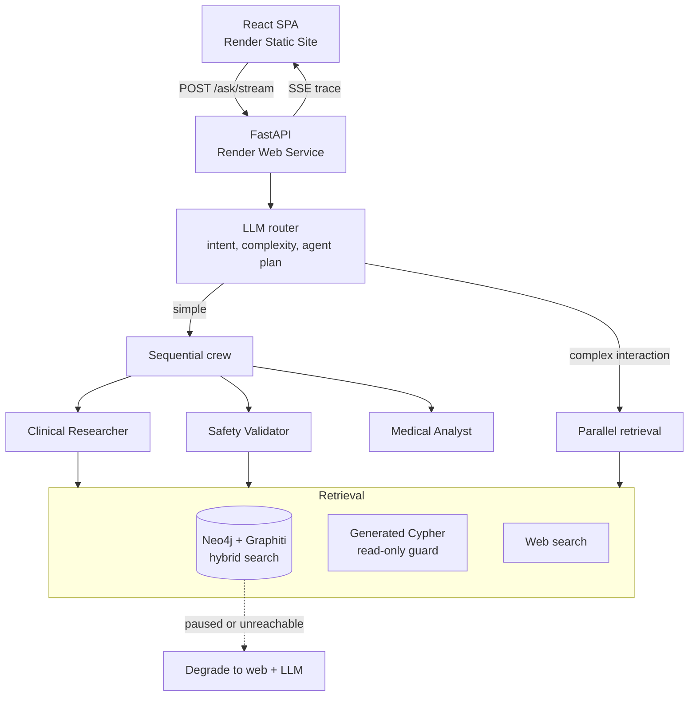

# Medical Agent

Multi-agent clinical question answering over a temporal knowledge graph, with the
reasoning pipeline streamed to the browser as it runs.

[Live demo](https://medical-agent-ui.onrender.com) · [API docs](https://medical-agent-api.onrender.com/docs)

The demo caps each visitor at five queries per day. The example questions are
pre-computed and exempt from that limit.

---

## What it does

A question is routed by a model before any work begins. The router decides whether
the question is medical, how complex it is, which of three agents to activate, how
many tool iterations each gets, and whether the answer needs explicit step-by-step
reasoning. A definition lookup runs one agent against one source. A multi-drug
safety question runs three agents across a knowledge graph, generated Cypher and
web search.

The browser shows that decision as it happens: the routing verdict, each agent
activating, every tool call with its latency, and the reasoning steps.

## Architecture



| Layer | Choice |
| --- | --- |
| Orchestration | CrewAI, three role-specialised agents |
| Reasoning model | Groq `llama-3.3-70b-versatile` |
| Knowledge graph | Neo4j AuraDB with Graphiti temporal GraphRAG |
| Embeddings | Gemini `gemini-embedding-001`, 768 dimensions |
| API | FastAPI, Server-Sent Events |
| Frontend | React 19, TypeScript, Tailwind 4, Vite |
| CI/CD | GitHub Actions gating Render deploy hooks |

## How a query flows

1. **Route.** One deterministic call (`temperature=0`) returns a JSON plan: intent,
   complexity 1-5, which agents to run, per-agent iteration budgets, suggested
   tools, and chain-of-thought steps when the question warrants them. Non-medical
   questions are refused here, before any expensive work.
2. **Select a mode.** Complex interaction questions fan out to every source
   concurrently and merge the results with per-source confidence scoring. Everything
   else runs the sequential crew, where each agent's output becomes the next one's
   context.
3. **Retrieve.** Hybrid graph search, LLM-generated Cypher for multi-hop traversals,
   and web search. Results are cached per tool with a one-hour TTL.
4. **Reason.** When the router asked for it, the findings are worked through the
   reasoning steps explicitly, and each step is emitted as its own event.
5. **Respond.** The answer streams back alongside the full trace.

## Design decisions

**Routing with a model, not keywords.** "Can I take these together" and "is this
combination safe" need identical handling, and no keyword list captures that. The
router costs one cheap call and saves running three agents on a question that needs
one. It is also the only component that must never hard-fail: if the routing call
errors, it falls back to a conservative configuration that runs the full crew,
because a wasted crew run is cheaper than wrongly refusing a clinical question.

**The trace comes from instrumented tools, not framework callbacks.** Each tool
publishes to a request-scoped event bus held in a `contextvars.ContextVar`. CrewAI
executes synchronously in a worker thread, and context variables do not cross
`run_in_executor` on their own, so the pipeline copies the context explicitly. This
keeps the trace independent of CrewAI's internals, which are not a stable API.

**Generated Cypher is treated as untrusted.** It is written by an LLM from user
text and then executed against the database, so a prompt-injected `DETACH DELETE`
is a real risk. Every generated query passes a write-clause denylist and is executed
with read routing. Both controls, because either alone is one bug from a wiped graph.

**Gemini embeddings instead of a local model.** The original `sentence-transformers`
embedder pulled in torch, roughly 2.5GB of image and over 500MB resident. The
deployment tier has 512MB. Moving embeddings to an API call was the difference
between deployable and not.

**The graph degrades instead of failing.** Neo4j AuraDB Free pauses after three days
idle. Graph access goes through a gateway that tracks availability and refuses to
retry inside a cooldown window, so one paused database cannot add a connection
timeout to every request. When it is down, tools return an explicit signal and the
agents answer from web search while saying that graph verification was unavailable.

**A static frontend, deliberately.** Render Static Sites consume none of the 750
free instance-hours, which leaves the entire budget for the API. It also means the
interface paints instantly while the backend is still cold, so a sleeping service
shows honest progress rather than a blank page.

## Running locally

Requires Python 3.11, Node 20, and a Neo4j instance.

```bash
cp .env.example .env          # add GROQ_API_KEY, GOOGLE_API_KEY, Neo4j credentials
pip install -r requirements-dev.txt
python -m scripts.seed_graph  # --reset to rebuild from scratch
uvicorn medical_agent.api.server:app --reload
```

```bash
cd frontend
npm install
npm run dev                   # http://localhost:5173
```

The API runs without a graph: set `GRAPH_ENABLED=false` and the agents fall back to
web search and the model.

```bash
pytest                        # no API keys required
ruff check medical_agent scripts tests
docker build -t medical-agent-api .
```

## Deployment

`render.yaml` defines both services. Render's auto-deploy is disabled on purpose:
its default is to deploy on every push, which bypasses CI entirely and would ship a
red build. Deploys are triggered by GitHub Actions after tests pass.

| Workflow | Trigger | Purpose |
| --- | --- | --- |
| `ci.yml` | push, PR | Ruff, pytest, frontend typecheck and build, Docker build plus a container health check |
| `deploy.yml` | CI success on `main` | Calls the Render deploy hooks, then waits for `/health` |
| `keepalive.yml` | every 10 minutes | Pings `/health`, keeping both the instance and AuraDB Free awake |

Required repository secrets: `RENDER_API_DEPLOY_HOOK`, `RENDER_UI_DEPLOY_HOOK`.
Required variable: `API_URL`.

Changing `EMBEDDING_DIM` or the embedding model requires re-running
`scripts/seed_graph.py --reset`: vectors from different models are not comparable,
so the index has to be rebuilt rather than appended to.

## API

| Endpoint | Purpose |
| --- | --- |
| `POST /ask` | Answer a question, returning the result once complete |
| `POST /ask/stream` | The same, streaming the pipeline trace as SSE |
| `GET /health` | Liveness and dependency status, makes no model calls |
| `GET /showcase` | Example queries and whether each is pre-computed |
| `GET /quota` | The caller's remaining daily allowance |
| `GET /sessions/{id}/history` | Conversation history |

Full schema at `/docs`.

## Limitations

- **Not medical advice.** This is an engineering demonstration. The graph holds a
  small curated drug dataset, not a clinical knowledge base, and answers are not
  reviewed by a clinician.
- **No evaluation suite.** Routing accuracy is unmeasured. A labelled set scoring
  intent and complexity against ground truth is the obvious next step, and its
  absence is why this README quotes no accuracy numbers.
- **State is per-process.** Sessions, the response cache and the rate limiter all
  live in memory and reset when the instance restarts. Redis is the production
  answer; it is not free.
- **Single instance.** One worker on 512MB. The rate limiter assumes this and would
  need a shared store before scaling out.
- **Cold starts.** The free tier sleeps after fifteen minutes idle. The keep-alive
  ping covers this, and the UI handles it honestly when it does not.
- **Answer quality is bounded by the graph.** Questions about drugs outside the
  seeded dataset fall through to web search, which is less reliable and is labelled
  as such in the trace.
